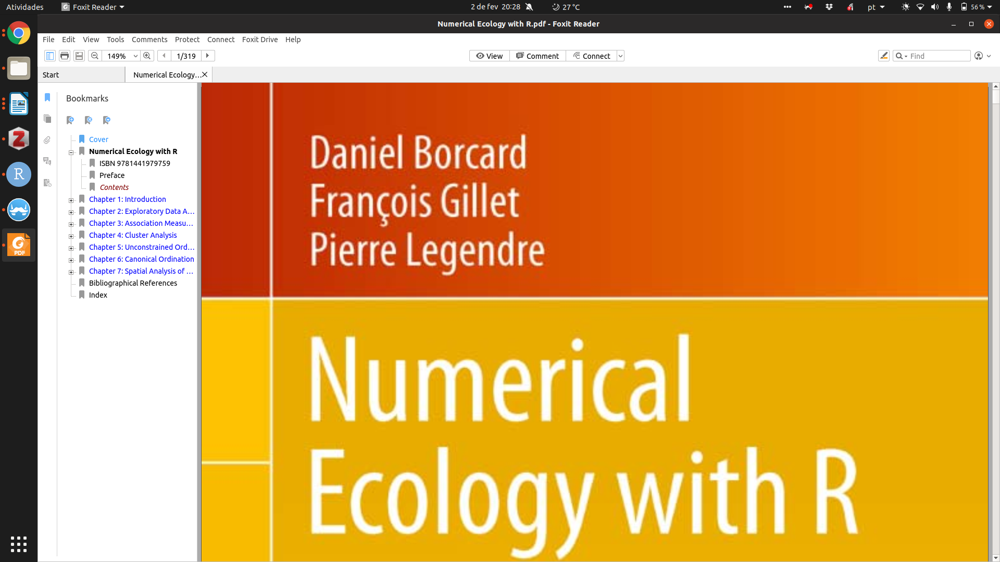

---

```{r setup, include=FALSE}
library(tidyverse)
library(knitr)
library(xaringan)
knitr::opts_chunk$set(echo = TRUE)
```


# Bases de dados ecológicos

*Slides* 
```{r}

<<<<<<< HEAD
knitr::include_url("/eco_numerica/slides/slides_aula1.html")
=======
>>>>>>> 573853bd1a537339aed80d730618263f83b458e9

```


### Exemplo 1 (matriz de presencias e ausências)

As bases de dados do R que serão usadas no nosso curso são reais e vêem de repositórios livres de dados e exemplos do próprio R para a área de ecologia. No entanto, para iniciar nossas atividades, vamos contruir uma base de dados fictícia apenas para entender sua estrutura.

A estrutura básica de bases de dados biológicos é a de matrizes que contem 'n' colunas e 'r' linhas (n x r). Geralmente temos espécies nas linhas e localidades nas colunas. Veja abaixo como criar uma matriz simples de 10 linhas e 4 colunas. As células serão preenchidas apenas com "1" e "0" indicando se a espécie está presente ou ausente da localidade amostrada.

```{r base_ficticia, echo=TRUE}
set.seed(999) # vai gerar sempre o mesmo resultado com as funções abaixo
tibble(
  spec = paste0("sp", 1:10),
  siteA = sample(c(0:1), replace=TRUE, size=10),
  siteB = sample(c(0:1), replace=TRUE, size=10),
  siteC = sample(c(0:1), replace=TRUE, size=10),
  siteD = sample(c(0:1), replace=TRUE, size=10)
)
```

### Exercício 1

Agora crie a sua base de dados, modificando os parâmetros do código acima para atender aos seguintes requisitos:

1) 20 espécies  
2) 8 localidades
3) Faça no seu computador

```{r exerc1, exercise = TRUE}

```

* Obviamente essas bases podem ser "subidas" ao R sem maiores problemas e o ideal é que você faça isso mesmo. Crie suas bases de dados numa planilha e salve-as em formato TXT ou CSV com muita atenção ao separadores e codificação (geralmente UTF-8)


### Exemplo 2 (matriz de abundâncias)

Agora podemos usar os mesmos comandos para gear uma matriz dessa vez com abundâncias fictícias. Portanto no lugar de zeros e uns, teremos números inteiros entre zero e infinito (em tese). Essas matrizes são mais realistas pois dão ideia da representatividade de cada espécie nas comunidades biológicas amostradas.


```{r base_abund}
set.seed(999) # vai gerar sempre o mesmo resultado com as funções abaixo
tibble(
  spec = paste0("sp", 1:10),
  siteA = sample(c(0:10), replace=TRUE, size=10), #agora vai ter números aleatórios entre 0 e 10
  siteB = floor(runif(10, min=0, max=10)), # aqui também
  siteC = sample(c(0:20), replace=FALSE, size=10), # aqui também mas até 20
  siteD = sample.int(20, 10) # aqui também até 20
)
```

### Exercício 2

Novamente crie a sua base de dados, modificando os parâmetros do código acima para atender aos seguintes requisitos:

1) 30 espécies  
2) 10 localidades  
3) Abundâncias devem variar entre 0-20 em 5 localidades e entre 0-50 em outras 5 localidades

```{r exerc2, exercise = TRUE}

```
## Extraindo informações básicas das matrizes

### Sumários

Qualquer análise de dados em ecologia começa com uma boa chacagem dos seu dados. Precisamos saber como se comportam os dados e para isso podemo começar com algumas funções simples como 'summary' (pactote base do R) ou 'summarize' (pacote tidyverse). Para isso, vamos pegar a matriz gerada com as abundâncias e dar a ela um nome, tranformando-a assim num objeto.

```{r summary, echo=TRUE}
set.seed(999) # vai gerar sempre o mesmo resultado com as funções abaixo
tibble(
  spec = paste0("sp", 1:10),
  siteA = sample(c(0:10), replace=TRUE, size=10), #agora vai ter números aleatórios entre 0 e 10
  siteB = floor(runif(10, min=0, max=10)), # aqui também
  siteC = sample(c(0:20), replace=FALSE, size=10), # aqui também mas até 20
  siteD = sample.int(20, 10) # aqui também até 20
)-> base1 # note que esse comando "->" apontou para um objeto de nome 'base1'


base1 # eis a nossa base agora com as espécies como nomes das linhas
```

### Agora podemos começar a *namorar* os dados

Um resumo geral da tabela com a função mais simples do R que mostra apenas alguns "momentos" da distribuição dos dados organizados por colunas, nesse caso, por sítio de estudo.

```{r, echo=TRUE}
summary(base1)

```

Existem outras funções do pacote tidyverse que podem ser utilizadas com maior objetividade e para coisas específicas. Par aum curso introdutório completo de "tidyverse" veja essa maravilha aqui do Maurício Vancine [Introdução ao tidyverse](https://mauriciovancine.github.io/disciplina-analise-geoespacial-r/01_aulas/04_pres_intro_geocomp_r.html) 

## Pacotes para Ecologia Numérica

```{r echo=TRUE, message=FALSE, warning=FALSE}
library(vegan) # vegetation analysis: tem quase tudo que precisamos
library(ade4)
```

### Livro: Numerical Ecology with R

```{r echo= FALSE, out.width = "100%"}
<<<<<<< HEAD
include_graphics("images/livro.png") 
=======
# 
>>>>>>> 573853bd1a537339aed80d730618263f83b458e9
```

Vamos usar muitos exemplos desse livro durante a disciplina e para acostumar, vamos começar por tentar reproduzir os exercícios do capítulo 2: "Exploratpry Data Analysis"

### Extraindo dados

```{r}

# Vamos carregar os dados que o livro usa como exemplo
load("/home/felipe/Google Drive/github/eco_numerica/data/NEwR-2ed_code_data/NEwR2-Data/Doubs.RData")

spe # matriz de abundância de espécies de peixes

spa # matriz espacial

env # matriz ambiental
```

*Para acessar os dados clique aqui (http://adn.biol.umontreal.ca/~numericalecology/numecolR/NEwR-2ed_code_data.zip)*


