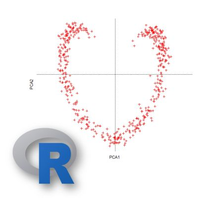

# **Ecologia Numérica**

Essa é a página da disciplina de Ecologia Numérica para o cursod e Bacharelado em Ciências Biológicas da UFPE. Aqui vocÊ vai encontrar todo o material didático necessário para acompanhar o conteúdo, principalmente os slides, exercícios e aulas gravadas.

## Como usar esse site e seus recursos

1. Faça um "fork" do repositório abaixo no seu github e siga as instruções do arquivo README para criar seu próprio site. [https://github.com/CrumpLab/LabJournalWebsite](https://github.com/CrumpLab/LabJournalWebsite)

2. Você vai editar **SEMPRE** o aqruivo Journal.Rmd. Dê uma sacada no link [Journal page](https://crumplab.github.io/LabJournalWebsite/Journal.html) para ver um exemplo de como começar a editar seu arquivo.

3. COnsulte os [links](https://crumplab.github.io/LabJournalWebsite/Links.html) que contém uma enrome quantidade de material acessório para aprendermos a mexer com essas ferramentas.

4. Edite tudo à vontade, é livre.

### [Ecologia Aplicada: O mundo segundo a ecologia](https://ecoaplic.org)

